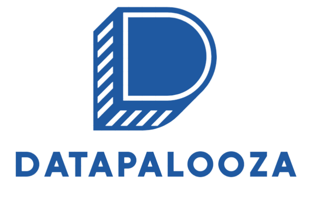

# Factored Datathon 2023 Datapalooza 🚀📊

Welcome to the Factored Datathon 2023 Datapalooza! 🎉 Join our team of passionate data enthusiasts as we delve into the exciting world of data-driven solutions. 📈💡

## Team Members 👥

Meet the brilliant minds behind this project:

- David Mora 🧠
- Eduards Mendez 📊
- Juan Esteban Cepeda 🚀
- Cristhian Pardo 💪

## Deployed Solution 🚀

Check out our deployed solution on Streamlit: [Factored Datathon 2023 Datapalooza](https://factored-datathon-2023-datapalooza.streamlit.app/Product_Search) 🛍️🔍

## Tech Stack 🛠️

We've utilized cutting-edge technologies to build this data solution:

- Pinecone 🌲
- Sentence Transformers 🤖
- Databricks 🚀
- Streamlit 🎛️

## File Structure 📂

Our project is organized into the following directories:

- business_analytics 📊
  - This directory houses notebooks dedicated to in-depth data analysis and machine learning exploration.
- business_intelligence 📈
  - Here, you'll find the code for our dynamic Streamlit application, enabling intuitive interactions with our data.
- data_pipeline 🚀
  - This directory is home to scripts responsible for efficiently processing both batch and streaming data, forming the backbone of our data pipeline.

## Features ✨

### Real-Time Analytics 🚀

Explore the power of real-time data analytics with our Factored EventHub and Datapalooza EventHub streaming data. Discover insights and trends effortlessly! 💎

Try our semantic search to find products with ease. Uncover intentions and sentiments from captured streaming data. Start your journey by searching for something like 'Nintendo Entertainment System'! 🕹️

### General Metrics 📊

Gain valuable insights from your data product to drive increased sales and strategic decisions! 💰

#### Understanding the Importance of Knowing Your Data Product

In today's data-driven era, understanding your data product is crucial for business success. Analyze customer preferences, purchasing trends, and satisfaction to make informed decisions and drive growth. 📈

#### The Impact of Customer Reviews 🌟

Customer reviews significantly influence purchasing decisions. More positive reviews build consumer confidence and provide insights for improvement. Leverage this data to adjust your marketing strategy and foster customer loyalty. 🌟

#### Strategic Business Planning 🚀

Collect and analyze data to optimize your business strategy. Identify relevant keywords and highlight strengths to enhance visibility and attract customers. Stay ahead in the competitive market with intelligent data-driven decisions. 💪

## Product Search 🔍

🧠 Semantic Search

Discover products effortlessly with our semantic search. Explore metrics and subgraphs of selected products. Streamline your search experience and uncover trends! 🚀

Start by searching for something like 'Nintendo 64'!

Explore product reviews and the product's neighborhood for insights. Dive into degree and betweenness centrality to gauge popularity and influence. 🌐

📝 Search for product reviews
🏘️ Explore product neighborhood

## Most Popular Products 🌟

Uncover top products using degree graph centrality. Explore metrics of the chosen product and its subgraph. Unveil trends and stay ahead of the game! 📊

Explore product reviews and the product's neighborhood to make informed decisions. Leverage centrality metrics for effective marketing strategies. 📈

📝 Search for product reviews
🏘️ Explore product neighborhood

## Contributing

Feel free to reach out to any of our team members for more information:

- David Mora: [LinkedIn](https://www.linkedin.com/in/davidfmora/)
- Eduards Mendez: [LinkedIn](https://www.linkedin.com/in/eduards-alexis-mendez-chipatecua-8584b21b4/)
- Juan Esteban Cepeda: [LinkedIn](https://www.linkedin.com/in/juan-e-cepeda-gestion/)
- Cristhian Pardo: [LinkedIn](https://www.linkedin.com/in/cristhian-pardo/)

Let's innovate and make data magic together! 🌟🔮